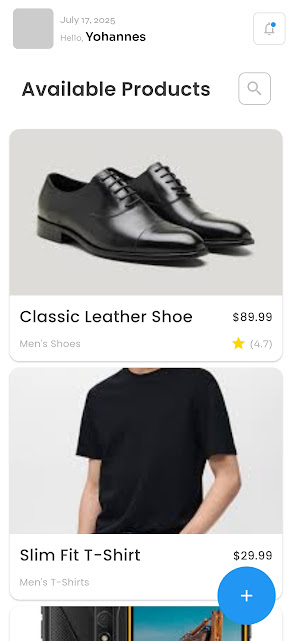
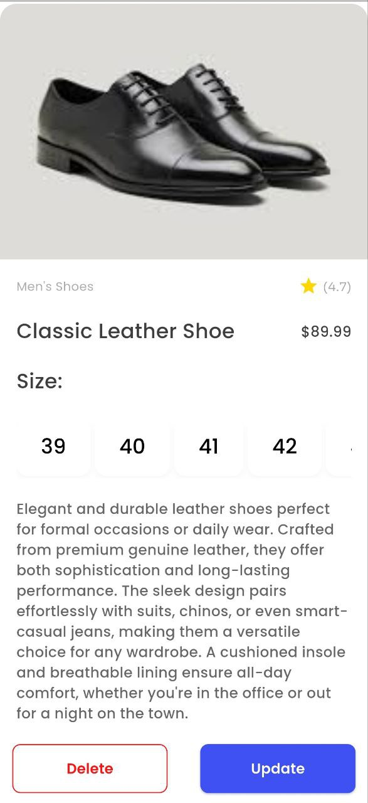
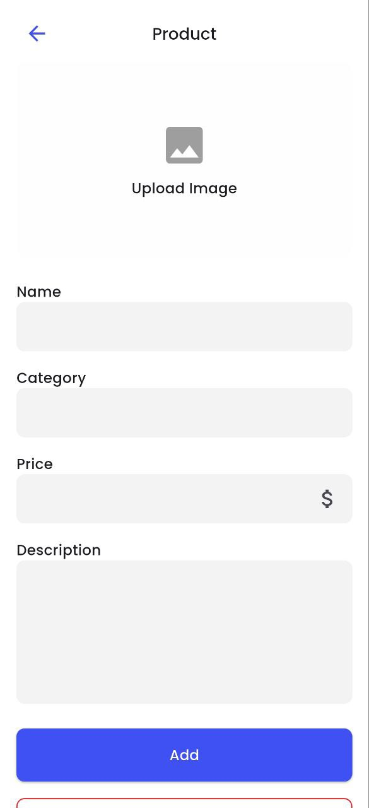

🏍️ Flutter E‑Commerce UI App (Clean Architecture)
A modern, cleanly structured E‑Commerce Product Management app built with Flutter using Clean Architecture principles. This project now includes: Product, Auth, and Chat features — each implemented with domain/use‑case/repository separation and BLoC for presentation.

✨ Features
Product

📦 View a list of products

➕ Create a product (name, price, description, imageUrl)

✏️ Update a product

🗑️ Delete a product

🔍 Product detail view (size/variant selection if needed)

♻️ Full offline/local support via local data source (optional)

Auth

🔑 Sign up / Register

🔐 Sign in / Login

🔄 Persistent session (SharedPreferences / secure storage)

🔒 Automatic nav to home on success

🔁 Reuse AuthBloc for both login and signup flows

Chat

💬 Real‑time messaging using Socket.IO

📥 Load chats & messages

📨 Send/receive messages live

✅ Delivery/read tracking support (message statuses)

🧩 Message model with sender metadata and timestamps

---

## 🧠 Architecture

This project follows the **Clean Architecture** pattern, promoting separation of concerns, testability, and scalability.

```
lib/
├─ core/                       # Common widgets, errors, constants
├─ features/
│  ├─ auth/
│  │  ├─ data/
│  │  ├─ domain/
│  │  ├─ presentation/
│  │  └─ injection_container.dart   # Registers AuthBloc, use cases, AuthRepository, etc.
│  ├─ product/
│  │  ├─ data/
│  │  ├─ domain/
│  │  ├─ presentation/
│  │  └─ injection_container.dart   # Registers ProductBloc, use cases, ProductRepository, etc.
│  └─ chat/
│     ├─ data/
│     ├─ domain/
│     ├─ presentation/
│     └─ injection_container.dart   # Registers ChatBloc, UserBloc, use cases, ChatRepository, socket DS, etc.
└─ main.dart


```

### 📂 Test Structure

The `test/` directory mirrors the `lib/` structure for easy unit and widget testing:

```
test/
🔾 features/
    └🔾 product/
        ├🔾 data/
        ├🔾 domain/
        └🔾 presentation/
```

---

## 🔄 Data Flow


Each layer only depends on the layer directly below it. This ensures high decoupling and testability.

---

## 📸 Screenshots

| Home Page                     | Product Details                     | Add Product                 |
| ----------------------------- | ----------------------------------- | --------------------------- |
|  |  |  |

---

## 🚀 Getting Started

### ✅ Prerequisites

- Flutter SDK: [Install Flutter](https://flutter.dev/docs/get-started/install)
- IDE: VS Code / Android Studio
- Android/iOS emulator or real device

---

### 🛠️ Installation

Clone the repository and run the app:

```bash
# Clone this repository
git clone https://github.com/your-username/flutter-ecommerce-ui.git

# Go into the project folder
cd flutter-ecommerce-ui

# Install dependencies
flutter pub get

# Run the app
flutter run
```

---

## ✅ Testing

Run all tests:

```bash
flutter test
```

Test files are organized using the same structure as the `lib/` directory to ensure alignment and clarity.

---

## 🧩 Technologies Used

- 🧱 Flutter
- 🗺 Clean Architecture
- 💡 Provider
- 🧪 flutter_test & mockito (for testing)

---

## 🤝 Contributing

Feel free to open issues or submit pull requests. Contributions are welcome!
